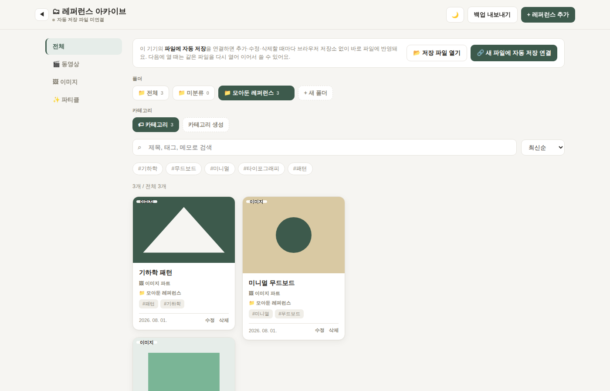

# 🗂 레퍼런스 아카이브

이미지·디자인 레퍼런스와 유튜브 영상을 한 곳에 모아 정리하는 개인용 웹앱입니다. 서버 없이 브라우저와 로컬 파일만으로 동작하며, PWA로 설치해 독립된 앱처럼 사용할 수 있습니다.

## 주요 기능

- 🖼️ **이미지 · 유튜브 모으기** — 이미지 URL/업로드와 유튜브 링크를 저장하면 자동으로 미리보기가 생성됩니다.
- 📁 **폴더 · 카테고리 분류** — 폴더와 카테고리로 원하는 기준에 맞춰 레퍼런스를 정리할 수 있습니다.
- 💾 **내 컴퓨터에 자동 저장** — 서버 없이 내 기기의 파일에 직접 저장되어, 데이터는 항상 내 손 안에 있습니다.

## 사용 방법

### 웹에서 바로 실행

1. [`index.html`](index.html)을 열어 **웹에서 바로 실행**을 클릭하면 [`app.html`](app.html)이 실행됩니다.
2. 크롬이나 엣지에서 열면 주소창 오른쪽에 설치 아이콘(⊕)이 나타납니다. 이를 눌러 설치하면 바탕화면/시작 메뉴에 아이콘이 생기고, 이후에는 독립된 앱 창으로 열립니다. 별도 설치 프로그램 없이 브라우저만 있으면 됩니다.

### 오프라인용 다운로드

[`reference-archive.zip`](reference-archive.zip)을 다운로드해 로컬에서 실행할 수도 있습니다.

## 프로젝트 구성

| 파일 | 설명 |
| --- | --- |
| `index.html` | 다운로드/실행 안내 페이지 |
| `app.html` | 실제 아카이브 앱 |
| `manifest.json` | PWA 매니페스트 |
| `sw.js` | 오프라인 캐싱을 위한 서비스 워커 |
| `reference-archive.zip` | 오프라인 실행용 압축 파일 |
